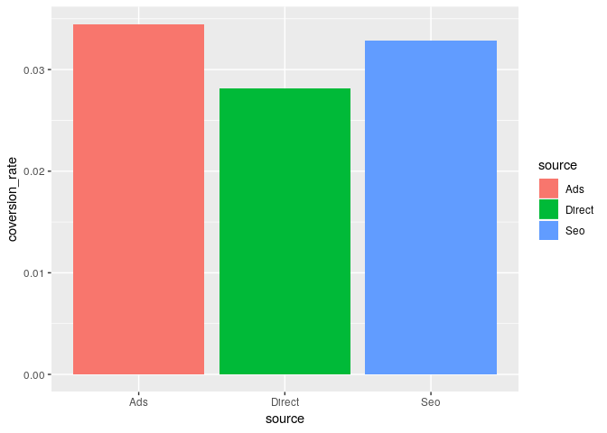
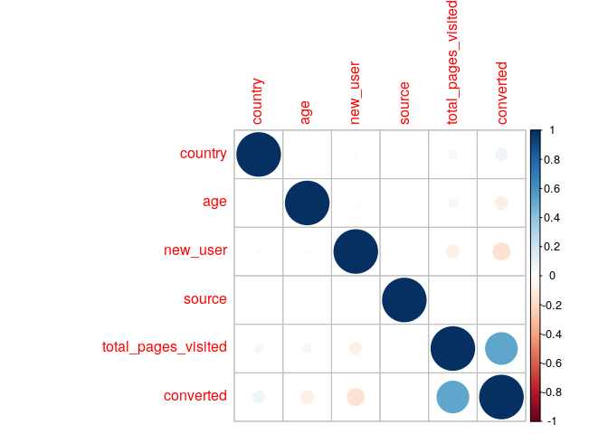
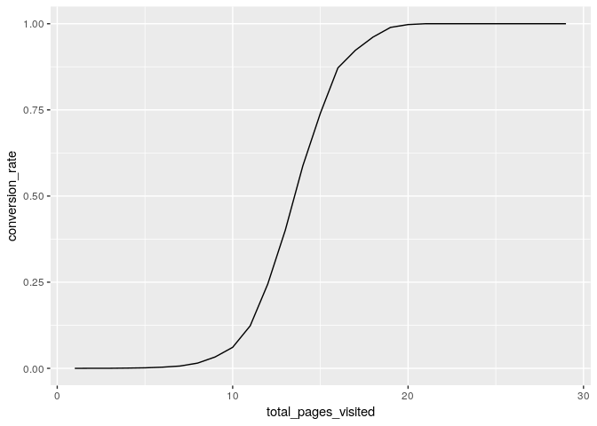
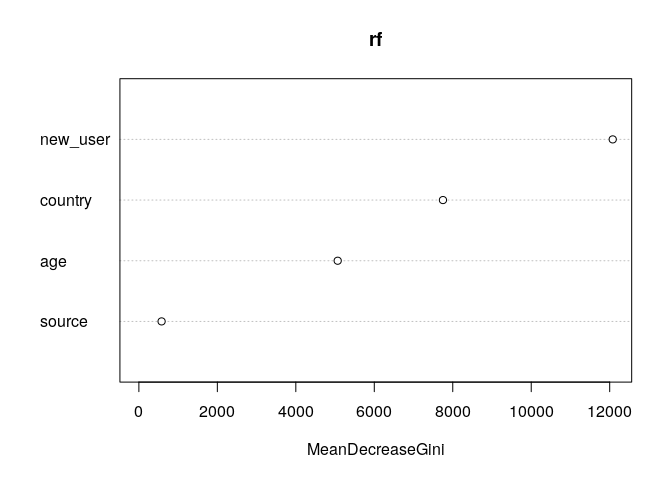
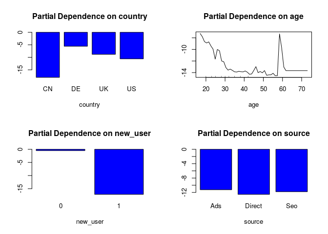

Load necessary libraries.

    load.libraries <- c('dplyr', 'rpart', 'ggplot2','corrplot' ,'randomForest')
    load.libraries

    ## [1] "dplyr"        "rpart"        "ggplot2"      "corrplot"    
    ## [5] "randomForest"

    sapply(load.libraries, require, character = TRUE)

    ##        dplyr        rpart      ggplot2     corrplot randomForest 
    ##         TRUE         TRUE         TRUE         TRUE         TRUE

Read data.

    data = read.csv('conversion_data.csv')
    head(data)

    ##   country age new_user source total_pages_visited converted
    ## 1      UK  25        1    Ads                   1         0
    ## 2      US  23        1    Seo                   5         0
    ## 3      US  28        1    Seo                   4         0
    ## 4   China  39        1    Seo                   5         0
    ## 5      US  30        1    Seo                   6         0
    ## 6      US  31        0    Seo                   1         0

    str(data)

    ## 'data.frame':    316200 obs. of  6 variables:
    ##  $ country            : Factor w/ 4 levels "China","Germany",..: 3 4 4 1 4 4 1 4 3 4 ...
    ##  $ age                : int  25 23 28 39 30 31 27 23 29 25 ...
    ##  $ new_user           : int  1 1 1 1 1 0 1 0 0 0 ...
    ##  $ source             : Factor w/ 3 levels "Ads","Direct",..: 1 3 3 3 3 3 3 1 2 1 ...
    ##  $ total_pages_visited: int  1 5 4 5 6 1 4 4 4 2 ...
    ##  $ converted          : int  0 0 0 0 0 0 0 0 0 0 ...

    summary(data)

    ##     country            age            new_user         source      
    ##  China  : 76602   Min.   : 17.00   Min.   :0.0000   Ads   : 88740  
    ##  Germany: 13056   1st Qu.: 24.00   1st Qu.:0.0000   Direct: 72420  
    ##  UK     : 48450   Median : 30.00   Median :1.0000   Seo   :155040  
    ##  US     :178092   Mean   : 30.57   Mean   :0.6855                  
    ##                   3rd Qu.: 36.00   3rd Qu.:1.0000                  
    ##                   Max.   :123.00   Max.   :1.0000                  
    ##  total_pages_visited   converted      
    ##  Min.   : 1.000      Min.   :0.00000  
    ##  1st Qu.: 2.000      1st Qu.:0.00000  
    ##  Median : 4.000      Median :0.00000  
    ##  Mean   : 4.873      Mean   :0.03226  
    ##  3rd Qu.: 7.000      3rd Qu.:0.00000  
    ##  Max.   :29.000      Max.   :1.00000

    data = subset(data, age < 80)
    summary(data)

    ##     country            age           new_user         source      
    ##  China  : 76602   Min.   :17.00   Min.   :0.0000   Ads   : 88739  
    ##  Germany: 13055   1st Qu.:24.00   1st Qu.:0.0000   Direct: 72420  
    ##  UK     : 48449   Median :30.00   Median :1.0000   Seo   :155039  
    ##  US     :178092   Mean   :30.57   Mean   :0.6855                  
    ##                   3rd Qu.:36.00   3rd Qu.:1.0000                  
    ##                   Max.   :79.00   Max.   :1.0000                  
    ##  total_pages_visited   converted      
    ##  Min.   : 1.000      Min.   :0.00000  
    ##  1st Qu.: 2.000      1st Qu.:0.00000  
    ##  Median : 4.000      Median :0.00000  
    ##  Mean   : 4.873      Mean   :0.03225  
    ##  3rd Qu.: 7.000      3rd Qu.:0.00000  
    ##  Max.   :29.000      Max.   :1.00000

    category_vars <- names(data)[which(sapply(data, is.factor))]
    category_vars

    ## [1] "country" "source"

    numeric_vars<- names(data)[which(sapply(data, is.integer))]
    numeric_vars

    ## [1] "age"                 "new_user"            "total_pages_visited"
    ## [4] "converted"

Scatter matrix of features
--------------------------

    num_loc <- which(names(data) %in% numeric_vars)[-length(numeric_vars)]
    num_loc

    ## [1] 2 3 5

    categ_loc <- which(names(data) %in% category_vars)
    categ_loc

    ## [1] 1 4

    y <- data['converted']

    make_plots <- function(data, xvar = xvar, yvar = yvar, fillvar = fillvar) {
       print(ggplot(data = data, aes_string(x = xvar, y = yvar)) + 
       geom_bar(stat = 'identity', aes_string(fill = fillvar)))
    }

    for (i in length(categ_loc)) {
     summarized_data <- data %>% 
                        group_by(eval(parse(text = category_vars[i]))) %>% 
                        summarise(mean(converted))
     names(summarized_data) <- c(category_vars[i], "coversion_rate")
     print(make_plots(summarized_data, xvar = names(summarized_data)[1], 
                yvar = names(summarized_data)[2], fillvar = names(summarized_data)[1]))
    }

### Correlation analysis

    corr_data = data 
    for (i in categ_loc) {
      corr_data[, i] <- as.integer(as.factor(corr_data[, i]))
    }

    correlations <- cor(corr_data)
    corrplot(correlations, method = 'circle', type = 'full')

    by_page <- data %>% 
               group_by(total_pages_visited) %>% 
               summarise(conversion_rate = mean(converted))
    by_page

    ## # A tibble: 29 x 2
    ##    total_pages_visited conversion_rate
    ##                  <int>           <dbl>
    ##  1                   1    0.0000000000
    ##  2                   2    0.0002279566
    ##  3                   3    0.0002509754
    ##  4                   4    0.0007796131
    ##  5                   5    0.0015699019
    ##  6                   6    0.0034367668
    ##  7                   7    0.0067694142
    ##  8                   8    0.0152379865
    ##  9                   9    0.0330673686
    ## 10                  10    0.0610677567
    ## # ... with 19 more rows

    qplot(total_pages_visited, conversion_rate, data = by_page, geom = 'line')

    data[, c('new_user', 'converted')] <- lapply(data[, c('new_user', 'converted')], as.factor)
    str(data)

    ## 'data.frame':    316198 obs. of  6 variables:
    ##  $ country            : Factor w/ 4 levels "China","Germany",..: 3 4 4 1 4 4 1 4 3 4 ...
    ##  $ age                : int  25 23 28 39 30 31 27 23 29 25 ...
    ##  $ new_user           : Factor w/ 2 levels "0","1": 2 2 2 2 2 1 2 1 1 1 ...
    ##  $ source             : Factor w/ 3 levels "Ads","Direct",..: 1 3 3 3 3 3 3 1 2 1 ...
    ##  $ total_pages_visited: int  1 5 4 5 6 1 4 4 4 2 ...
    ##  $ converted          : Factor w/ 2 levels "0","1": 1 1 1 1 1 1 1 1 1 1 ...

    levels(data$country)[levels(data$country) == 'Germany'] <- 'DE'
    levels(data$country)[levels(data$country) == 'China'] <- 'CN'

    summary(data)

    ##  country          age        new_user      source      
    ##  CN: 76602   Min.   :17.00   0: 99454   Ads   : 88739  
    ##  DE: 13055   1st Qu.:24.00   1:216744   Direct: 72420  
    ##  UK: 48449   Median :30.00              Seo   :155039  
    ##  US:178092   Mean   :30.57                             
    ##              3rd Qu.:36.00                             
    ##              Max.   :79.00                             
    ##  total_pages_visited converted 
    ##  Min.   : 1.000      0:306000  
    ##  1st Qu.: 2.000      1: 10198  
    ##  Median : 4.000                
    ##  Mean   : 4.873                
    ##  3rd Qu.: 7.000                
    ##  Max.   :29.000

### Train a Random Forest Model

    train_index <- sample(nrow(data), size = nrow(data) * 0.66)

    train <- data[train_index, ]
    test <- data[-train_index, ]

    rf = randomForest(x = train[, -ncol(train)], y = train[, ncol(train)], 
                     xtest = test[, -ncol(test)], ytest = test[, ncol(train)], 
                     ntree = 100, mtry = 3, keep.forest = TRUE)

    rf

    ## 
    ## Call:
    ##  randomForest(x = train[, -ncol(train)], y = train[, ncol(train)],      xtest = test[, -ncol(test)], ytest = test[, ncol(train)],      ntree = 100, mtry = 3, keep.forest = TRUE) 
    ##                Type of random forest: classification
    ##                      Number of trees: 100
    ## No. of variables tried at each split: 3
    ## 
    ##         OOB estimate of  error rate: 1.47%
    ## Confusion matrix:
    ##        0    1 class.error
    ## 0 201035  865 0.004284299
    ## 1   2196 4594 0.323416789
    ##                 Test set error rate: 1.42%
    ## Confusion matrix:
    ##        0    1 class.error
    ## 0 103652  448 0.004303554
    ## 1   1076 2332 0.315727700

    y_col = ncol(train)
    removed_cols = which(names(train) %in% c('total_pages_visited', 'converted'))
                

    rf = randomForest(x = train[, -removed_cols], y = train[, y_col], 
                     xtest = test[, -removed_cols], ytest = test[, y_col], 
                     ntree = 100, mtry = 3, keep.forest = TRUE, classwt = c(0.7, 0.3))
    rf

    ## 
    ## Call:
    ##  randomForest(x = train[, -removed_cols], y = train[, y_col],      xtest = test[, -removed_cols], ytest = test[, y_col], ntree = 100,      mtry = 3, classwt = c(0.7, 0.3), keep.forest = TRUE) 
    ##                Type of random forest: classification
    ##                      Number of trees: 100
    ## No. of variables tried at each split: 3
    ## 
    ##         OOB estimate of  error rate: 14.07%
    ## Confusion matrix:
    ##        0     1 class.error
    ## 0 175608 26292   0.1302229
    ## 1   3075  3715   0.4528719
    ##                 Test set error rate: 14.09%
    ## Confusion matrix:
    ##       0     1 class.error
    ## 0 90500 13600   0.1306436
    ## 1  1543  1865   0.4527582

    # Dotchart of variable importance as measured by a Random Forest
    varImpPlot(rf, type = 2)

    # gives a graphical depiction of the marginal effect of a variable on the class probability (classification) or response (regression).
    op <- par(mfrow = c(2, 2))
    partialPlot(rf, train, country, 1)
    partialPlot(rf, train, age, 1)
    partialPlot(rf, train, new_user, 1)
    partialPlot(rf, train, source, 1)

    tree = rpart(data$converted ~., data[, -removed_cols], control = rpart.control(maxdepth = 3), parms = list(prior = c(0.7, 0.3)))
    tree

    ## n= 316198 
    ## 
    ## node), split, n, loss, yval, (yprob)
    ##       * denotes terminal node
    ## 
    ##  1) root 316198 94859.4000 0 (0.70000000 0.30000000)  
    ##    2) new_user=1 216744 28268.0600 0 (0.84540048 0.15459952) *
    ##    3) new_user=0 99454 66591.3400 0 (0.50063101 0.49936899)  
    ##      6) country=CN 23094   613.9165 0 (0.96445336 0.03554664) *
    ##      7) country=DE,UK,US 76360 50102.8100 1 (0.43162227 0.56837773)  
    ##       14) age>=29.5 38341 19589.5200 0 (0.57227507 0.42772493) *
    ##       15) age< 29.5 38019 23893.0000 1 (0.33996429 0.66003571) *
